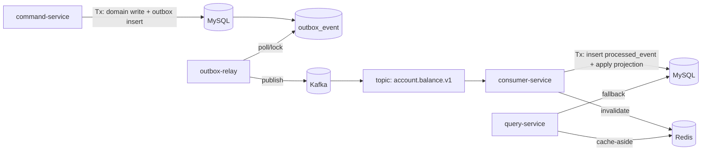

# ARCHITECTURE — Reliability Lab (Kafka × MySQL × Redis)

## 1) 도메인(실험용)
- Account(계정) + Ledger(증감 기록)
- Command: Deposit / Withdraw (side effect가 “2번 처리되면 바로 티 나는” 도메인)

### 핵심 이벤트
- `AccountBalanceChanged` (dedup_key = tx_id)
- 목적:
  - 중복 처리 시 balance가 2번 증가(실패 케이스)
  - 이벤트 유실 시 projection/cache가 stale(실패 케이스)

---

## 2) 정상 아키텍처(운영 표준)

보장

유실 방지: Outbox(도메인 tx 내부 기록)

중복 무해화: processed_event(UNIQUE dedup_key)

캐시 최신화는 “불가능” 전제 → invalidation(DEL or versioned) + TTL + stampede 방어

---

3) 실패 아키텍처(의도적)

(A) Outbox 없음(direct-produce)

DB commit 이후 Kafka send 전 크래시 → 이벤트 유실 → projection/cache stale

(B) processed_event 없음

relay 재시도/중복발행 → consumer side effect 2번 반영

(C) offset 선커밋

offset commit 후 DB 반영 전 크래시 → 재처리 불가(처리 유실)

(D) 캐시 잘못 사용

invalidation 없음 + 긴 TTL → stale

stampede 방어 없음 + TTL 동시 만료 → DB overload

---

4) 토픽 설계(권장)

account.balance.v1 (main)

account.balance.retry.5s

account.balance.retry.1m

account.balance.dlq

키(key) 정책

key = account_id (동일 계정 이벤트 ordering 보장)

---

5) DB 테이블(요약)

account(account_id, balance, updated_at)

ledger(tx_id, account_id, amount, created_at) (tx_id 유니크)

outbox_event(id, event_id, dedup_key, event_type, payload, status, attempts, next_attempt_at, ...)

processed_event(consumer_group, dedup_key, processed_at, source_topic, partition, offset)

account_projection(account_id, balance, version, updated_at) (consumer가 만드는 read model)
