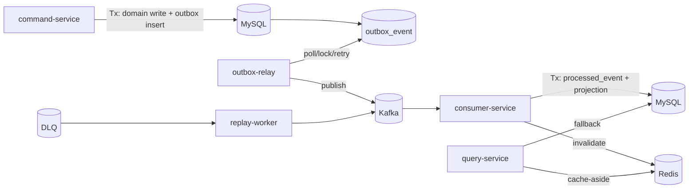

# ARCHITECTURE — Reliability Lab

## 1) 현재 상태와 목표
- 현재: Phase 0 스캐폴드(문서/계약/infra 골격)
- 목표: Outbox + Idempotent Consumer + DLQ/Replay + Cache correctness를 실험 가능한 형태로 구현

## 2) 도메인
- Account(잔액), Ledger(증감 내역)
- Command: Deposit / Withdraw
- 핵심 이벤트: `AccountBalanceChanged` (`dedup_key = tx_id`)

## 3) 목표 아키텍처

## 4) 정합성 보장 전략
- 유실 방지: Outbox를 도메인 트랜잭션 안에서 기록
- 중복 무해화: `processed_event(consumer_group, dedup_key)` UNIQUE
- 캐시 수렴: invalidation + TTL + stampede 방어

## 5) 실패 아키텍처(의도적)
- Outbox 없음: DB commit 후 publish 전 크래시 -> 유실
- Idempotency 없음: 중복 메시지 재처리 -> side effect 2회
- Offset 선커밋: DB 반영 전 크래시 -> at-most-once 유실
- Invalidation 없음: stale cache 고착

## 6) 토픽/키 설계
- main: `account.balance.v1`
- retry: `account.balance.retry.5s`, `account.balance.retry.1m`
- dlq: `account.balance.dlq`
- key 정책: `account_id`

## 7) 데이터 모델(목표)
- domain: `account`, `ledger`
- outbox: `outbox_event`
- dedup: `processed_event`
- read model: `account_projection`
- audit: `replay_audit`

## 8) 이벤트 계약
`contracts/avro/event-envelope.avsc` 필드:
- `event_id`
- `dedup_key`
- `event_type`
- `schema_version`
- `occurred_at`
- `trace_id`
- `payload`
