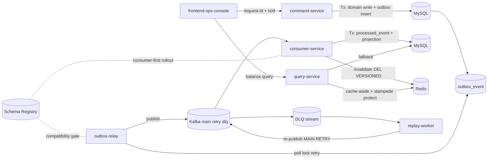

# ARCHITECTURE — Reliability Lab

## 1) 현재 상태와 목표
- 현재: Phase 0~7(코어 파이프라인, 고급 실험, AWS/IAM, Frontend idempotency 경로) 구현/검증 완료
- 목표: 실패/복구 케이스를 failpoint + env toggle 기반으로 결정론 재현하고, 자동 assert로 회귀를 차단

## 2) 도메인
- Account(잔액), Ledger(증감 내역)
- Command: Deposit / Withdraw
- 핵심 이벤트: `AccountBalanceChanged` (`dedup_key = tx_id`)

## 3) 런타임 아키텍처

```mermaid
flowchart LR
  FE[frontend-ops-console] -->|request-id + txId| CS[command-service]
  FE -->|balance query| QS[query-service]
  CS -->|Tx: domain write + outbox insert| DB[(MySQL)]
  DB --> OUT[(outbox_event)]
  REL[outbox-relay] -->|poll lock retry| OUT
  REL -->|publish| K[(Kafka main retry dlq)]
  K --> CON[consumer-service]
  CON -->|Tx: processed_event + projection| DB2[(MySQL)]
  CON -->|invalidate DEL VERSIONED| R[(Redis)]
  QS -->|cache-aside + stampede protect| R
  QS -->|fallback| DB2
  K --> DLQ[(DLQ stream)]
  DLQ --> RP[replay-worker]
  RP -->|re-publish MAIN RETRY| K
  SR[(Schema Registry)] -.compatibility gate.- REL
  SR -.consumer-first rollout.- CON
```

## 4) 정합성 보장 전략
- 유실 방지: Outbox를 도메인 트랜잭션 안에서 기록
- 중복 무해화: `processed_event(consumer_group, dedup_key)` UNIQUE
- 캐시 수렴: invalidation + TTL + stampede 방어

## 5) 실패 아키텍처(의도적)
- Outbox 없음: DB commit 후 publish 전 크래시 -> 유실
- Idempotency 없음: 중복 메시지 재처리 -> side effect 2회
- Offset 선커밋: DB 반영 전 크래시 -> at-most-once 유실
- Invalidation 없음: stale cache 고착
- IAM 권한 누락: group join/offset commit/idempotent produce 실패
- Frontend request-id 미재사용: 동일 의도 재시도 중복 전송 위험 증가

## 6) 토픽/키 설계
- main: `account.balance.v1`
- retry: `account.balance.retry.5s`, `account.balance.retry.1m`
- dlq: `account.balance.dlq`
- key 정책: `account_id`

## 7) 데이터 모델
- domain: `account`, `ledger`
- outbox: `outbox_event`
- dedup: `processed_event`
- read model: `account_projection`
- audit: `replay_audit`

## 8) 이벤트 계약
`contracts/avro/event-envelope.avsc` 필드:
- `event_id`
- `dedup_key`
- `event_type`
- `schema_version`
- `occurred_at`
- `trace_id`
- `payload`

## 9) 결정론 실험 제어면
- failpoint/env toggle은 서비스 공통 규약으로 노출한다.
- `scripts/exp run|assert`를 기준으로 모든 실험을 재현하고 자동 검증한다.
- IAM 실패 케이스는 정책 템플릿 + 시나리오(`E-IAM-001~003`) 조합으로 재현한다.

## 10) 배포/호환성 규칙
- Kafka 전달 보장은 At-Least-Once를 전제하고 앱 레이어에서 정합성을 보장한다.
- 스키마 진화는 Consumer-First + compatibility gate를 기본으로 한다.
- breaking 변경은 subject/topic 버전 분리 또는 upcaster 전략으로 처리한다.
